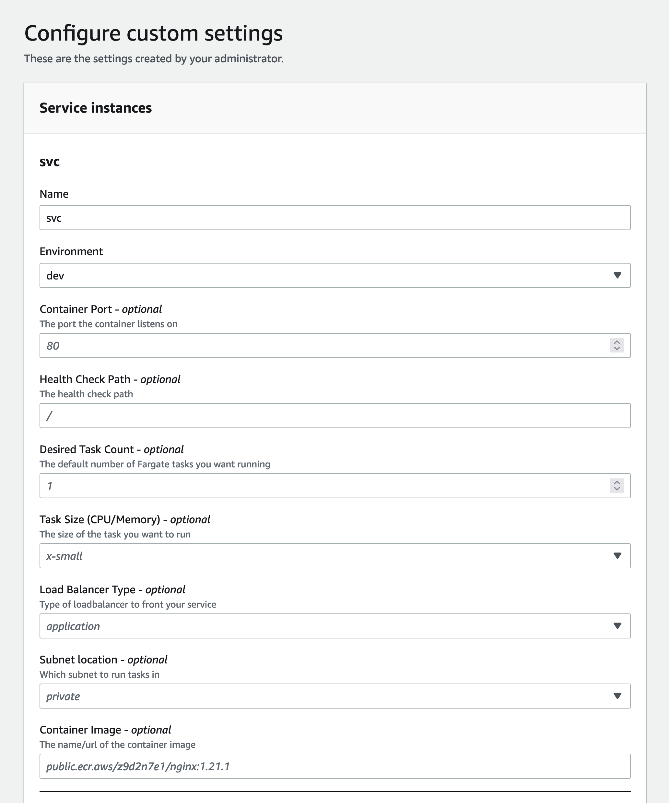

## Description

This template is the same as the [ecs-fargate-load-balanced-service](../../ecs-fargate-load-balanced-service/) but adds infrastructure to enable CI/CD.  The template outputs the following resources:

- Private ECR repository
- AWS Identity Provider and IAM Role that GitHub Actions can assume with access to ECR, Proton, and S3
- Generated GitHub Actions workflow file (`.github/workflows.deploy.yml`)
- AWS S3 bucket with a URL to download the workflow

The idea with this template is that once you deploy it, you can click on the output link to download a copy of a file that you can simply drop into your application code repo on GitHub to do CI/CD.  The CI/CD workflow will:

- build your code into a container image (requies a Dockerfile)
- push your image to ECR
- update your Proton service to deploy the image to the ECS service


This template is compatible with the [vpc-ecs-cluster](../../environment-templates/vpc-ecs-cluster/README.md) template.


## Register Template in AWS Proton

To register this template in AWS Proton, you can either use the GUI console, or you can run the `make template` command specifying an S3 bucket used to store the template bundle and the version you'd like to register.

```sh
cd terraform/service-templates/ecs-fargate-load-balanced-service-cicd-github-actions
make template bucket=my-bucket version=1
```

### Input Parameters




## Security

See [CONTRIBUTING](../../CONTRIBUTING.md#security-issue-notifications) for more information.

## License

This library is licensed under the MIT-0 License. See the [LICENSE](../../LICENSE) file.
